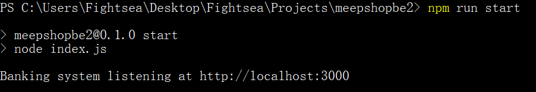

# meepShop 後端考題 Q2

## Environment Setup

### `npm install` or `yarn install`

## Run the Server

### `npm run start` or `yarn start`

## API

### POST /api/accounts/create

#### Create a new account

### GET /api/accounts/:id/balance

#### Get account balance

### POST /api/accounts/:id/deposit

#### Deposit money into an account

### POST /api/accounts/:id/withdraw

#### Withdraw money from an account

### POST /api/accounts/transfer

#### Transfer money from one account to another

### GET /api/accounts/logs

#### Get transaction logs

## Testing (Unit Test & Integration Test)

### `npm run test` or `yarn test`

## Build Docker Image

### `docker-compose build`

## Run Docker Container

### `docker-compose up`

